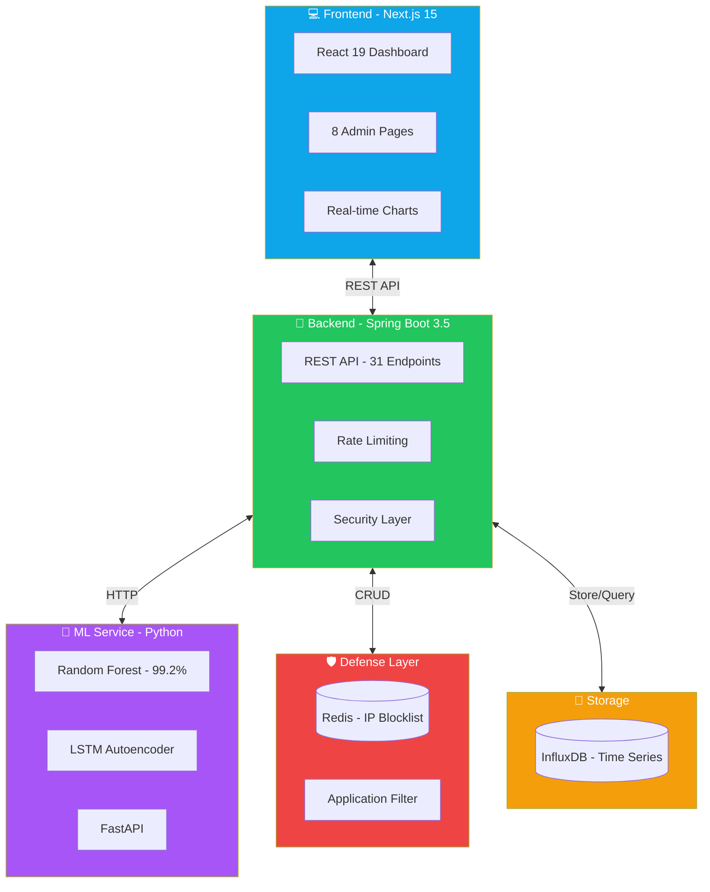

<div align="center">

# 🛡️ DefenDDoS Cloud


[](.)
[](.)
[](LICENSE)
[](.)

<p align="center">
  
</p>

<p align="center">
  <a href="#-quick-start"></a>
  <a href="#-features"></a>
  <a href="#-architecture"></a>
  <a href="#-api-docs"></a>
</p>

</div>

---

## 🌟 Overview

> **DefenDDoS Cloud** is an enterprise-grade, AI-powered security platform that provides real-time DDoS detection and automatic mitigation using dual machine learning models.

<table align="center">
<tr>
<td align="center" width="200">
<br/>
<b>Dual ML Detection</b><br/>
<sub>RF + LSTM Models<br/>99.2% Accuracy</sub>
</td>
<td align="center" width="200">
<br/>
<b>Real-Time Analysis</b><br/>
<sub>Sub-second response<br/>24/7 monitoring</sub>
</td>
<td align="center" width="200">
<br/>
<b>Auto-Mitigation</b><br/>
<sub>Automatic IP blocking<br/>via Redis + iptables</sub>
</td>
<td align="center" width="200">
<br/>
<b>Modern Dashboard</b><br/>
<sub>Next.js 15 + React 19<br/>Real-time charts</sub>
</td>
</tr>
</table>

---

## 🏗️ Architecture



---

## 🛠️ Tech Stack

<div align="center">

### 🔧 Backend
[](.)
[](.)
[](.)

### 🤖 Machine Learning
[](.)
[](.)
[](.)
[](.)

### 💻 Frontend
[](.)
[](.)
[](.)
[](.)

### 💾 Infrastructure
[](.)
[](.)
[](.)

</div>

---

## ⚡ Quick Start

### Prerequisites

```bash
✅ Java 21+       ✅ Python 3.11+      ✅ Node.js 18+
✅ Docker         ✅ Docker Compose    ✅ pnpm
```

### 🚀 One-Command Startup

```powershell
# Clone the repository
git clone https://github.com/ByteAcumen/DefenDDoS-Cloud.git
cd DefenDDoS-Cloud

# Run everything with one command
.\START_EVERYTHING.ps1
```

<details>
<summary>📋 <b>What this does</b> (click to expand)</summary>

| Step | Service | Port |
|------|---------|------|
| 1️⃣ | Start Redis & InfluxDB | 6379, 8086 |
| 2️⃣ | Start Spring Boot Backend | 8081 |
| 3️⃣ | Start ML Service (Python) | 8000 |
| 4️⃣ | Start Next.js Frontend | 3000 |
| 5️⃣ | Verify all health checks | ✅ |

</details>

### 🌐 Access Points

| Service | URL | Description |
|---------|-----|-------------|
| 🖥️ **Dashboard** | http://localhost:3000 | Main admin interface |
| 🔧 **Backend API** | http://localhost:8081 | REST API endpoints |
| 🤖 **ML Service** | http://localhost:8000 | AI prediction service |
| 💾 **InfluxDB** | http://localhost:8086 | Time-series database |

---

## 🔒 Security Features

<div align="center">

| Feature | Status | Description |
|---------|:------:|-------------|
| 🔑 **API Key Auth** | ✅ | All endpoints require X-API-KEY header |
| ⏱️ **Rate Limiting** | ✅ | 60 req/min standard, 5 req/min critical |
| 🛡️ **XSS Protection** | ✅ | Input sanitization on all endpoints |
| 📝 **Audit Logging** | ✅ | Separate security-audit.log |
| 🔐 **Actuator Security** | ✅ | Only /health is public |
| 🌐 **Redis IP Blocking** | ✅ | Distributed, persistent blocklist |

</div>

### 🧪 Security Test Results

```
╔════════════════════════════════════════════╗
║     DDoS DEFENSE TEST RESULTS              ║
╠════════════════════════════════════════════╣
║ Test 1: Backend Health      ✅ PASS        ║
║ Test 2: Actuator Security   ✅ PASS        ║
║ Test 3: API Authentication  ✅ PASS        ║
║ Test 4: Rate Limiting       ✅ PASS        ║
║ Test 5: Redis IP Blocking   ✅ PASS        ║
║ Test 6: Critical Endpoints  ✅ PASS        ║
╠════════════════════════════════════════════╣
║ SCORE: 6/6 (100%) | GRADE: A+             ║
╚════════════════════════════════════════════╝
```

---

## 📊 API Endpoints

<details>
<summary><b>🚦 Traffic Management (5 endpoints)</b></summary>

| Method | Endpoint | Description |
|--------|----------|-------------|
| `POST` | `/api/v1/traffic/ingest` | Ingest network traffic |
| `POST` | `/api/v1/traffic/predict-attack` | ML prediction |
| `GET` | `/api/v1/traffic/query` | Query history |
| `GET` | `/api/v1/traffic/summary` | Statistics |
| `GET` | `/api/v1/traffic/visualization` | Chart data |

</details>

<details>
<summary><b>🛡️ Mitigation & Blocking (8 endpoints)</b></summary>

| Method | Endpoint | Description |
|--------|----------|-------------|
| `POST` | `/api/v1/mitigation/block/{ip}` | Block IP |
| `POST` | `/api/v1/mitigation/unblock/{ip}` | Unblock IP |
| `GET` | `/api/v1/mitigation/blocked` | List blocked |
| `GET` | `/api/v1/mitigation/check/{ip}` | Check status |
| `POST` | `/api/v1/mitigation/block/bulk` | Bulk block |
| `POST` | `/api/v1/mitigation/clear` | Clear all |
| `GET` | `/api/v1/mitigation/status` | System status |

</details>

<details>
<summary><b>🔍 Security & Monitoring (7 endpoints)</b></summary>

| Method | Endpoint | Description |
|--------|----------|-------------|
| `GET` | `/api/v1/security/status` | Security status |
| `GET` | `/api/v1/security/dashboard` | Overview |
| `POST` | `/api/v1/security/analyze/{ip}` | Analyze IP |
| `POST` | `/api/v1/security/trigger-detection` | Manual trigger |
| `GET` | `/actuator/health` | Health check |

</details>

---

## 🧪 Testing

### Run DDoS Attack Simulation

```powershell
# Industry-grade security test suite
.\SIMULATE_DDOS_ATTACK.ps1 -ApiKey "your-api-key" -NonInteractive

# Backend-specific tests
cd backend-service
.\test-ddos-defense.ps1 -ApiKey "your-api-key"
```

### Test Coverage

- ✅ Authentication & Authorization
- ✅ Rate Limiting (Standard & Critical)
- ✅ IP Blocking via Redis
- ✅ Actuator Endpoint Security
- ✅ Input Validation & XSS Prevention
- ✅ DDoS Flood Simulation

---

## 📂 Project Structure

```
DefenDDoS-Cloud/
├── 📁 backend-service/          # Spring Boot Backend (Java 21)
│   ├── 📁 src/main/java/        # Java source files
│   ├── 📁 ml-service/           # Python ML Service
│   ├── 📄 docker-compose.yml    # Container orchestration
│   └── 📄 test-ddos-defense.ps1 # Security test script
│
├── 📁 defenddos-frontend/       # Next.js 15 Frontend
│   ├── 📁 src/app/              # App Router pages
│   ├── 📁 src/components/       # React components
│   └── 📁 src/hooks/            # Custom hooks
│
├── 📁 docs/                     # Documentation (23 files)
├── 📄 SIMULATE_DDOS_ATTACK.ps1  # Full attack simulation
├── 📄 START_EVERYTHING.ps1      # One-click startup
└── 📄 README.md                 # This file
```

---

## 📈 ML Model Performance

<div align="center">

| Model | Accuracy | Latency | Size |
|-------|:--------:|:-------:|:----:|
| **Random Forest** | 99.2% | <50ms | 5.8 MB |
| **LSTM Autoencoder** | 94.5%* | <100ms | 111 KB |

<sub>*Anomaly detection for zero-day attacks</sub>

</div>

### Attack Types Detected

<div align="center">

| Attack Type | Detection Rate | Severity |
|-------------|:--------------:|:--------:|
| SYN Flood | 99.5% | 🔴 Critical |
| UDP Flood | 98.8% | 🔴 High |
| HTTP Flood | 99.2% | 🔴 High |
| DNS Amplification | 97.5% | 🔴 Critical |
| Slowloris | 96.8% | 🟡 Medium |
| ICMP Flood | 98.2% | 🟡 Medium |

</div>

---

## 🤝 Contributing

Contributions are welcome! Please read our [Contributing Guide](CONTRIBUTING.md) for details.

```bash
# Fork the repository
# Create your feature branch
git checkout -b feature/AmazingFeature

# Commit your changes
git commit -m 'Add some AmazingFeature'

# Push to the branch
git push origin feature/AmazingFeature

# Open a Pull Request
```

---

## 📄 License

This project is licensed under the MIT License - see the [LICENSE](LICENSE) file for details.

---

<div align="center">


**Made with ❤️ by [ByteAcumen](https://github.com/ByteAcumen)**

[](https://github.com/ByteAcumen/DefenDDoS-Cloud)
[](https://github.com/ByteAcumen/DefenDDoS-Cloud/fork)

</div>
