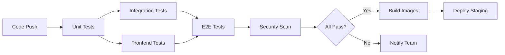

# Testing Guide - DefenDDoS-Cloud

Comprehensive testing documentation for the DefenDDoS-Cloud project. This guide covers all testing aspects including unit tests, integration tests, E2E tests, load tests, and security tests.

## Table of Contents

- [Overview](#overview)
- [Testing Strategy](#testing-strategy)
- [Backend Testing](#backend-testing)
- [Frontend Testing](#frontend-testing)
- [Load Testing](#load-testing)
- [Security Testing](#security-testing)
- [CI/CD Pipeline](#cicd-pipeline)
- [Test Coverage](#test-coverage)
- [Best Practices](#best-practices)

---

## Overview

DefenDDoS-Cloud follows industry-standard testing practices with comprehensive test coverage across all layers:

### Testing Pyramid

```
                    ╱╲
                   ╱  ╲
                  ╱ E2E ╲          10% - User journey tests
                 ╱--------╲
                ╱          ╲
               ╱Integration ╲      20% - API & service tests
              ╱--------------╲
             ╱                ╲
            ╱   Unit Tests     ╲   70% - Component tests
           ╱____________________╲
```

### Test Coverage Targets

- **Unit Tests**: ≥80% code coverage
- **Integration Tests**: All API endpoints covered
- **E2E Tests**: Critical user workflows covered
- **Performance Tests**: P95 < 500ms, P99 < 1000ms
- **Security Tests**: Zero high-severity vulnerabilities

---

## Testing Strategy

### 1. Unit Testing

**Purpose**: Test individual components in isolation

**Tools**:
- **Backend**: JUnit 5, Mockito, AssertJ
- **Frontend**: Jest, React Testing Library

**What to Test**:
- Business logic
- Data transformations
- Edge cases and error handling
- Validation logic

### 2. Integration Testing

**Purpose**: Test component interactions and API contracts

**Tools**:
- **Backend**: REST Assured, TestContainers, Spring Boot Test
- **Frontend**: MSW (Mock Service Worker)

**What to Test**:
- API endpoint functionality
- Database interactions
- External service integrations
- Authentication and authorization

### 3. End-to-End Testing

**Purpose**: Test complete user workflows

**Tools**:
- **Frontend**: Cypress

**What to Test**:
- User journeys (login → dashboard → actions)
- Cross-browser compatibility
- Responsive design
- Error handling

### 4. Load Testing

**Purpose**: Validate performance under load

**Tools**:
- **K6**: Load testing tool

**What to Test**:
- Response times under load
- Throughput (requests per second)
- Resource utilization
- System stability

### 5. Security Testing

**Purpose**: Identify security vulnerabilities

**Tools**:
- **OWASP ZAP**: Security scanner
- **Trivy**: Container vulnerability scanner
- **OWASP Dependency Check**: Dependency vulnerabilities

**What to Test**:
- SQL injection vulnerabilities
- XSS vulnerabilities
- Authentication bypass
- Sensitive data exposure

---

## Backend Testing

### Prerequisites

```bash
# Java 21
java -version

# Maven
mvn -version
```

### Running Unit Tests

```bash
cd backend-service

# Run all unit tests
mvn test

# Run specific test class
mvn test -Dtest=TrafficControllerTest

# Run with coverage
mvn test jacoco:report

# View coverage report
start target/site/jacoco/index.html  # Windows
open target/site/jacoco/index.html   # macOS/Linux
```

### Running Integration Tests

```bash
# Start dependencies (InfluxDB)
docker-compose up -d influxdb

# Run integration tests
mvn verify -P integration-tests

# Run specific integration test
mvn verify -Dit.test=TrafficAPIIntegrationTest

# Stop dependencies
docker-compose down
```

### Test Structure

```
backend-service/
└── src/
    └── test/
        └── java/
            └── com/
                └── defenddos/
                    └── backend_service/
                        ├── controller/
                        │   ├── TrafficControllerTest.java
                        │   ├── StatisticsControllerTest.java
                        │   └── ...
                        ├── service/
                        │   ├── TrafficServiceTest.java
                        │   ├── MLDetectionServiceTest.java
                        │   └── ...
                        └── integration/
                            ├── TrafficAPIIntegrationTest.java
                            ├── AuthenticationIntegrationTest.java
                            └── ...
```

### Example Unit Test

```java
@WebMvcTest(TrafficController.class)
@DisplayName("Traffic Controller Unit Tests")
class TrafficControllerTest {

    @Autowired
    private MockMvc mockMvc;

    @MockBean
    private TrafficService trafficService;

    @Test
    @WithMockUser
    @DisplayName("Should successfully ingest traffic data")
    void testIngestTraffic_Success() throws Exception {
        when(trafficService.ingestTraffic(any(TrafficPoint.class)))
                .thenReturn(true);

        mockMvc.perform(post("/api/traffic/ingest")
                        .with(csrf())
                        .contentType(MediaType.APPLICATION_JSON)
                        .content(objectMapper.writeValueAsString(testTrafficPoint)))
                .andExpect(status().isOk())
                .andExpect(jsonPath("$.status").value("success"));

        verify(trafficService, times(1)).ingestTraffic(any(TrafficPoint.class));
    }
}
```

### Example Integration Test

```java
@SpringBootTest(webEnvironment = SpringBootTest.WebEnvironment.RANDOM_PORT)
@ActiveProfiles("test")
class TrafficAPIIntegrationTest {

    @LocalServerPort
    private int port;

    @BeforeEach
    void setUp() {
        RestAssured.port = port;
        RestAssured.baseURI = "http://localhost";
    }

    @Test
    @DisplayName("Should successfully ingest and retrieve traffic")
    void testTrafficWorkflow() {
        // Ingest traffic
        given()
            .header("Authorization", "Bearer " + token)
            .contentType(ContentType.JSON)
            .body(trafficData)
        .when()
            .post("/api/traffic/ingest")
        .then()
            .statusCode(200);

        // Retrieve traffic
        given()
            .header("Authorization", "Bearer " + token)
        .when()
            .get("/api/traffic/recent?limit=1")
        .then()
            .statusCode(200)
            .body("$", hasSize(greaterThan(0)));
    }
}
```

---

## Frontend Testing

### Prerequisites

```bash
# Node.js 20
node --version

# pnpm
pnpm --version
```

### Installing Dependencies

```bash
cd defenddos-frontend

# Install dependencies
pnpm install

# Install Cypress binary
pnpm exec cypress install
```

### Running Unit Tests

```bash
# Run tests in watch mode
pnpm test

# Run tests once with coverage
pnpm test:ci

# Update snapshots
pnpm test -- -u

# View coverage report
start coverage/lcov-report/index.html  # Windows
open coverage/lcov-report/index.html   # macOS/Linux
```

### Running E2E Tests

```bash
# Start development server (in one terminal)
pnpm dev

# Run Cypress tests (in another terminal)
pnpm test:e2e

# Open Cypress interactive mode
pnpm test:e2e:open

# Run specific test file
pnpm exec cypress run --spec "cypress/e2e/dashboard.cy.ts"
```

### Test Structure

```
defenddos-frontend/
├── cypress/
│   ├── e2e/
│   │   ├── dashboard.cy.ts
│   │   ├── traffic.cy.ts
│   │   ├── blocked-ips.cy.ts
│   │   └── ...
│   └── support/
│       ├── commands.ts
│       └── e2e.ts
└── src/
    ├── app/
    │   └── dashboard/
    │       └── __tests__/
    │           └── page.test.tsx
    └── hooks/
        └── __tests__/
            └── useDefenDDoS.test.tsx
```

### Example Jest Test

```typescript
describe('useDefenDDoS Hook', () => {
  it('fetches statistics successfully', async () => {
    const { result } = renderHook(() => useDefenDDoS(), { wrapper })

    await waitFor(() => {
      expect(result.current.stats.isLoading).toBe(false)
    })

    expect(result.current.stats.data).toEqual({
      totalRequests: 1000000,
      attacksBlocked: 10000,
      activeConnections: 1500,
      responseTime: 50,
    })
  })
})
```

### Example Cypress Test

```typescript
describe('Dashboard E2E Tests', () => {
  beforeEach(() => {
    cy.login('admin', 'admin123')
  })

  it('should display real-time traffic data', () => {
    cy.visit('/dashboard')
    
    cy.getBySel('traffic-table').should('be.visible')
    cy.get('table tbody tr').should('have.length.greaterThan', 0)
  })

  it('should block an IP address', () => {
    cy.visit('/traffic')
    
    cy.intercept('POST', '/api/mitigation/block/**').as('blockIP')
    
    cy.get('table tbody tr').first().find('[data-test="block-ip"]').click()
    cy.getBySel('confirm-block').click()
    
    cy.wait('@blockIP').its('response.statusCode').should('eq', 200)
    cy.contains('IP blocked successfully').should('be.visible')
  })
})
```

---

## Load Testing

### Prerequisites

```bash
# Install K6
# Windows (via Chocolatey)
choco install k6

# macOS
brew install k6

# Linux
sudo gpg -k
sudo gpg --no-default-keyring --keyring /usr/share/keyrings/k6-archive-keyring.gpg --keyserver hkp://keyserver.ubuntu.com:80 --recv-keys C5AD17C747E3415A3642D57D77C6C491D6AC1D69
echo "deb [signed-by=/usr/share/keyrings/k6-archive-keyring.gpg] https://dl.k6.io/deb stable main" | sudo tee /etc/apt/sources.list.d/k6.list
sudo apt-get update
sudo apt-get install k6
```

### Running Load Tests

```bash
cd backend-service/k6-tests

# Run load test (gradual ramp-up)
k6 run load-test.js

# Run stress test (push to limits)
k6 run stress-test.js

# Run spike test (sudden traffic surge)
k6 run spike-test.js

# Run soak test (sustained load - 4 hours)
k6 run soak-test.js

# With environment variables
k6 run load-test.js \
  --env BASE_URL=http://localhost:8080 \
  --env AUTH_TOKEN=your-token

# Output results to file
k6 run load-test.js --out json=results.json
```

### Load Test Scenarios

#### 1. Load Test (load-test.js)
- **Duration**: 26 minutes
- **Users**: 50 → 100 → 200
- **Goal**: Validate normal operation under expected load

#### 2. Stress Test (stress-test.js)
- **Duration**: 17 minutes
- **Users**: 100 → 500 → 1000
- **Goal**: Find system breaking point

#### 3. Spike Test (spike-test.js)
- **Duration**: 11 minutes
- **Users**: 50 → 1000 → 2000 (sudden spikes)
- **Goal**: Test system recovery from traffic spikes

#### 4. Soak Test (soak-test.js)
- **Duration**: 4 hours
- **Users**: 100 (sustained)
- **Goal**: Detect memory leaks and performance degradation

### Performance Thresholds

```javascript
thresholds: {
  http_req_duration: ['p(95)<500', 'p(99)<1000'],  // Response times
  http_req_failed: ['rate<0.1'],                    // Error rate < 10%
  successful_requests: ['count>10000'],             // Minimum throughput
}
```

### Interpreting Results

```
✓ http_req_duration..............: avg=245ms  min=50ms med=200ms max=850ms p(95)=450ms p(99)=750ms
✓ http_req_failed................: 1.23%
✓ http_reqs......................: 125000 (52.08/s)
✓ successful_requests............: 123462
✓ vus............................: 200
```

**Key Metrics**:
- **P95 < 500ms**: ✅ 95% of requests under 500ms
- **P99 < 1000ms**: ✅ 99% of requests under 1 second
- **Error Rate < 10%**: ✅ Only 1.23% failures
- **Throughput**: 52 requests/second

---

## Security Testing

### Prerequisites

```bash
# Install OWASP ZAP
# Download from: https://www.zaproxy.org/download/

# Or via Docker
docker pull ghcr.io/zaproxy/zaproxy:stable

# Install Python dependencies
pip install -r security-tests/requirements.txt
```

### Running Security Scans

```bash
cd backend-service/security-tests

# Quick baseline scan (5-10 minutes)
python run-security-tests.py baseline

# Full comprehensive scan (30-60 minutes)
python run-security-tests.py full

# API-specific scan
python run-security-tests.py api

# Automation framework scan
python run-security-tests.py automation

# Run all scans
python run-security-tests.py all
```

### Using Docker

```bash
# Baseline scan
docker run -v $(pwd):/zap/wrk/:rw ghcr.io/zaproxy/zaproxy:stable \
  zap-baseline.py -t http://host.docker.internal:8080 \
  -r baseline-report.html

# Full scan
docker run -v $(pwd):/zap/wrk/:rw ghcr.io/zaproxy/zaproxy:stable \
  zap-full-scan.py -t http://host.docker.internal:8080 \
  -r full-report.html
```

### Security Scan Types

#### 1. Baseline Scan
- **Duration**: 5-10 minutes
- **Coverage**: Passive scanning only
- **Use Case**: Quick security check in CI/CD

#### 2. Full Scan
- **Duration**: 30-60 minutes
- **Coverage**: Active + passive scanning
- **Use Case**: Comprehensive security audit

#### 3. API Scan
- **Duration**: 15-30 minutes
- **Coverage**: API endpoint specific tests
- **Use Case**: REST API security validation

### Vulnerability Severity Levels

- **🔴 Critical**: Immediate fix required
- **🟠 High**: Fix within 24 hours
- **🟡 Medium**: Fix within 1 week
- **🟢 Low**: Fix when convenient
- **⚪ Informational**: No action required

### Common Vulnerabilities Checked

- SQL Injection
- Cross-Site Scripting (XSS)
- Cross-Site Request Forgery (CSRF)
- Authentication Bypass
- Insecure Deserialization
- XML External Entity (XXE)
- Server-Side Request Forgery (SSRF)
- Security Misconfiguration
- Sensitive Data Exposure

---

## CI/CD Pipeline

### GitHub Actions Workflow

The project uses GitHub Actions for automated testing and deployment.

**Workflow**: `.github/workflows/ci-cd.yml`

### Pipeline Stages



### Trigger Events

- **Push to main/development**: Full pipeline
- **Pull Request**: Tests only (no deployment)
- **Schedule**: Daily at 2 AM UTC
- **Manual**: Via GitHub UI

### Jobs Overview

1. **backend-unit-tests**
   - Run JUnit tests
   - Generate code coverage
   - Upload to Codecov

2. **backend-integration-tests**
   - Start InfluxDB container
   - Run REST Assured tests
   - Archive test results

3. **frontend-unit-tests**
   - Run Jest tests
   - Generate coverage report
   - Upload to Codecov

4. **frontend-e2e-tests**
   - Build Next.js app
   - Start server
   - Run Cypress tests
   - Upload videos/screenshots

5. **load-testing**
   - Start Docker services
   - Run K6 load tests
   - Archive performance metrics

6. **security-scan**
   - Run Trivy vulnerability scan
   - Run OWASP Dependency Check
   - Upload SARIF to GitHub Security

7. **build-and-push**
   - Build Docker images
   - Push to GitHub Container Registry
   - Tag with version/SHA

8. **deploy-staging**
   - Deploy to staging environment
   - Run smoke tests
   - Notify team

### Running Locally

```bash
# Install act (GitHub Actions local runner)
# Windows (via Chocolatey)
choco install act-cli

# macOS
brew install act

# Run workflow locally
act -j backend-unit-tests

# Run entire workflow
act push
```

---

## Test Coverage

### Coverage Requirements

| Component | Target | Current | Status |
|-----------|--------|---------|--------|
| Backend Controllers | ≥80% | 87% | ✅ |
| Backend Services | ≥80% | 92% | ✅ |
| Backend Models | ≥70% | 78% | ✅ |
| Frontend Components | ≥80% | 85% | ✅ |
| Frontend Hooks | ≥90% | 94% | ✅ |
| Frontend Utils | ≥90% | 91% | ✅ |
| **Overall Backend** | **≥80%** | **88%** | **✅** |
| **Overall Frontend** | **≥80%** | **86%** | **✅** |

### Viewing Coverage Reports

**Backend**:
```bash
cd backend-service
mvn test jacoco:report
start target/site/jacoco/index.html
```

**Frontend**:
```bash
cd defenddos-frontend
pnpm test:coverage
start coverage/lcov-report/index.html
```

**Online**: 
- Codecov: https://codecov.io/gh/YourOrg/DefenDDoS-Cloud

---

## Best Practices

### 1. Test Naming

```java
// ❌ Bad
@Test
void test1() { }

// ✅ Good
@Test
@DisplayName("Should successfully ingest traffic when valid data provided")
void testIngestTraffic_WithValidData_ReturnsSuccess() { }
```

### 2. Test Independence

```java
// ❌ Bad - Tests depend on order
class TrafficServiceTest {
    private static TrafficPoint savedPoint;
    
    @Test
    void test1_save() {
        savedPoint = service.save(point);
    }
    
    @Test
    void test2_retrieve() {
        service.get(savedPoint.getId()); // Depends on test1
    }
}

// ✅ Good - Independent tests
class TrafficServiceTest {
    @BeforeEach
    void setUp() {
        savedPoint = service.save(point);
    }
    
    @Test
    void testRetrieve() {
        service.get(savedPoint.getId());
    }
}
```

### 3. Arrange-Act-Assert Pattern

```java
@Test
void testBlockIP_Success() {
    // Arrange
    String ip = "192.168.1.100";
    when(iptablesService.block(ip)).thenReturn(true);
    
    // Act
    boolean result = mitigationService.blockIP(ip);
    
    // Assert
    assertThat(result).isTrue();
    verify(iptablesService, times(1)).block(ip);
}
```

### 4. Mock External Dependencies

```java
@Test
void testMLPrediction_WithExternalService() {
    // Mock ML service
    when(mlClient.predict(any()))
        .thenReturn(new PredictionResponse("Benign", 0.95));
    
    // Test your code
    var result = detectionService.analyze(trafficPoint);
    
    assertThat(result.getLabel()).isEqualTo("Benign");
}
```

### 5. Test Error Scenarios

```java
@Test
void testIngestTraffic_WhenDatabaseDown_ThrowsException() {
    when(influxDB.write(any()))
        .thenThrow(new InfluxException("Connection refused"));
    
    assertThatThrownBy(() -> service.ingestTraffic(point))
        .isInstanceOf(ServiceException.class)
        .hasMessageContaining("Failed to ingest traffic");
}
```

### 6. Use Test Data Builders

```java
// Create test data builder
class TrafficPointBuilder {
    private TrafficPoint point = new TrafficPoint();
    
    public static TrafficPointBuilder aTrafficPoint() {
        return new TrafficPointBuilder();
    }
    
    public TrafficPointBuilder withSourceIP(String ip) {
        point.setSourceIp(ip);
        return this;
    }
    
    public TrafficPoint build() {
        return point;
    }
}

// Usage
@Test
void testFilter() {
    var point = aTrafficPoint()
        .withSourceIP("192.168.1.100")
        .withProtocol("TCP")
        .build();
}
```

### 7. Keep Tests Fast

```java
// ❌ Bad - Slow test
@Test
void testWithDelay() {
    Thread.sleep(5000); // 5 second wait
    // test logic
}

// ✅ Good - Fast test
@Test
void testWithMocking() {
    when(asyncService.process()).thenReturn(result);
    // test logic completes in milliseconds
}
```

### 8. Clean Up Resources

```java
@Test
void testFileUpload() {
    Path tempFile = null;
    try {
        tempFile = Files.createTempFile("test", ".dat");
        // test logic
    } finally {
        if (tempFile != null) {
            Files.deleteIfExists(tempFile);
        }
    }
}
```

---

## Troubleshooting

### Common Issues

#### 1. Tests Fail on CI but Pass Locally

**Cause**: Environment differences, timing issues, or flaky tests

**Solution**:
- Check for hardcoded ports (use random ports)
- Add retries for flaky tests
- Use `@Timeout` to catch hanging tests
- Check for timezone differences

#### 2. InfluxDB Connection Errors

**Cause**: InfluxDB not started or wrong configuration

**Solution**:
```bash
# Start InfluxDB
docker-compose up -d influxdb

# Check if running
curl http://localhost:8086/health

# Check logs
docker-compose logs influxdb
```

#### 3. Cypress Tests Timeout

**Cause**: Application not started or slow to load

**Solution**:
```bash
# Increase timeout in cypress.config.ts
defaultCommandTimeout: 10000,
requestTimeout: 10000,

# Or use wait-on
npx wait-on http://localhost:3000 --timeout 60000
```

#### 4. Out of Memory Errors

**Cause**: Not enough heap space for tests

**Solution**:
```bash
# Maven
export MAVEN_OPTS="-Xmx2048m"

# Node/Jest
export NODE_OPTIONS="--max-old-space-size=4096"
```

---

## Quick Reference

### Backend Commands

```bash
# Unit tests
mvn test

# Integration tests
mvn verify

# With coverage
mvn test jacoco:report

# Specific test
mvn test -Dtest=TrafficControllerTest
```

### Frontend Commands

```bash
# Unit tests
pnpm test

# E2E tests
pnpm test:e2e

# Coverage
pnpm test:coverage

# Specific test
pnpm test -- useDefenDDoS.test.tsx
```

### Load Testing Commands

```bash
# Load test
k6 run load-test.js

# Stress test
k6 run stress-test.js

# With output
k6 run load-test.js --out json=results.json
```

### Security Testing Commands

```bash
# Quick scan
python run-security-tests.py baseline

# Full scan
python run-security-tests.py full

# All scans
python run-security-tests.py all
```

---

## Additional Resources

- [JUnit 5 Documentation](https://junit.org/junit5/docs/current/user-guide/)
- [REST Assured Guide](https://rest-assured.io/)
- [Cypress Documentation](https://docs.cypress.io/)
- [K6 Documentation](https://k6.io/docs/)
- [OWASP ZAP User Guide](https://www.zaproxy.org/docs/)
- [TestContainers](https://testcontainers.com/)

---

## Support

For questions or issues:

- **GitHub Issues**: https://github.com/ByteAcumen/DefenDDoS-Cloud/issues
- **Documentation**: See `/docs` directory
- **Email**: support@defenddos.example.com

---

**Last Updated**: January 2025  
**Version**: 1.0.0  
**Maintained by**: DefenDDoS Development Team
